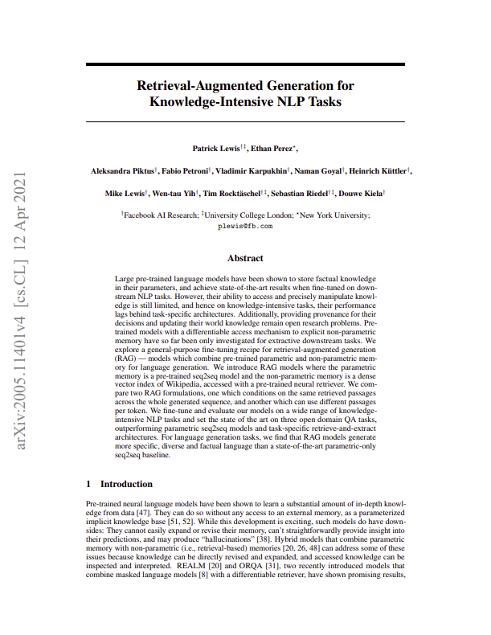
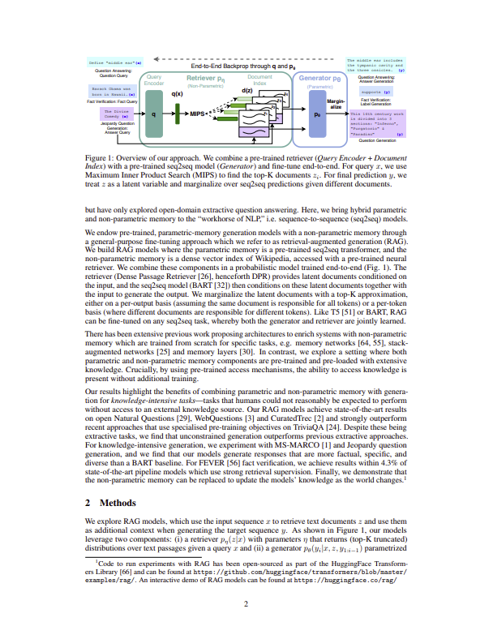

# RAG Agent

A from-scratch implementation of **Retrieval-Augmented Generation (RAG)** built
around the foundational paper
[*Retrieval-Augmented Generation for Knowledge-Intensive NLP Tasks*](https://arxiv.org/abs/2005.11401)
(Lewis et al., Facebook AI Research / UCL / NYU, 2020).



RAG combines two memory systems:

- **Parametric memory** — knowledge stored in a pre-trained language model's weights.
- **Non-parametric memory** — an external, explicit knowledge source (here, a
  vector index) that the model queries at generation time.

By retrieving relevant context before answering, RAG makes a model's answers more
**factual, specific, and provable**, and lets you update its world knowledge by
swapping the index instead of retraining.

This project is a hands-on reproduction of that idea: it parses the paper itself
out of a PDF, chunks it, embeds the chunks into a vector store, and answers
questions about it through a retriever + generator pipeline.

## Architecture



The system flows through two stages:

1. **Offline (indexing):** PDF → parse → clean → split → embed → store.
2. **Online (query):** question → retrieve top-k chunks → prompt the LLM with
   those chunks as context → stream the answer back.

## Features

- **Docling-based PDF parsing** with EasyOCR (full-page OCR) and table-structure
  recognition — converts a scanned/structured paper into clean Markdown.
- **Text cleaning & deduplication** — Unicode/encoding repair (`ftfy` + NFKC),
  boilerplate stripping, and exact-duplicate removal via content hashing.
- **LangChain retrieval pipeline** — loader → recursive chunking → embeddings →
  Chroma vector store → LCEL retrieval chain.
- **Interactive console** — ask questions about the paper in a terminal.
- **CI-friendly** parsing: a reduced page range (1–5) kicks in when `CI` is set.

## Repository layout

```
.
├── assets/
│   ├── paper_cover.png        # Paper cover (front page)
│   └── rag_pipeline.png       # Architecture/pipeline figure
├── langchain/
│   ├── document_loader.py     # Loads samples/RAG.pdf (PyPDFLoader)
│   ├── text_splitting.py      # RecursiveCharacterTextSplitter (chunk=100, overlap=10)
│   ├── embedding.py           # sentence-transformers/all-MiniLM-L6-v2
│   ├── vector.py              # Chroma vector store (rag_collection) + indexing
│   ├── retrieval_chain.py     # LCEL chain: retriever → prompt → LLM → output
│   └── main.py                # Interactive terminal console
├── pdf_parser.py              # Docling pipeline: OCR + table structure → Markdown
├── clean.py                   # clean_text() and dedup() helpers
├── parsed_document.md         # Parsed output (no OCR)
├── parsed_document_with_ocr.md# Parsed output (with EasyOCR)
├── samples/
│   └── RAG.pdf                # The source paper
├── requirements.txt
└── .env                       # API keys (see Configuration)
```

> `langchain/` modules are chained by **imports with side effects** (e.g. importing
> `vector` triggers `vector_store.add_documents(...)`). The intended entry point is
> `main.py`; each module builds on the previous one in order:
> `document_loader → text_splitting → embedding → vector → retrieval_chain → main`.

## How it works

### 1. Parse the paper (Docling)

[`pdf_parser.py`](pdf_parser.py) converts `samples/RAG.pdf` into Markdown using
Docling with:

- Full-page EasyOCR (recovers text from scans/images)
- Table-structure recognition with cell matching
- `torch.compile` disabled on Windows (see [Gotchas](#gotchas))

```bash
python pdf_parser.py            # → parsed_document_with_ocr.md
```

### 2. Clean & deduplicate

[`clean.py`](clean.py) exports two helpers for RAG prep:

- `clean_text(raw)` — fixes mojibake/encoding, normalizes Unicode (NFKC),
  collapses whitespace, and strips boilerplate lines.
- `dedup(chunks)` — drops exact duplicates by SHA-256 content hash.

### 3. Index (LangChain)

```
document_loader  →  text_splitting  →  embedding  →  vector
```

- **Load:** `PyPDFLoader` reads `samples/RAG.pdf`.
- **Chunk:** `RecursiveCharacterTextSplitter` — `chunk_size=100`, `chunk_overlap=10`.
- **Embed:** `HuggingFaceEmbeddings` with `all-MiniLM-L6-v2`.
- **Store:** Chroma collection `rag_collection`.

### 4. Retrieve & generate

```
question → retriever (top-k=2) → {context, question} → prompt → LLM → answer
```

[`retrieval_chain.py`](langchain/retrieval_chain.py) builds an LCEL chain that:

1. Embeds the question and retrieves the 2 most similar chunks (`search_type="similarity"`).
2. Injects them into a prompt instructing the model to answer only from context
   (or say "I don't know").
3. Generates with **Groq** `openai/gpt-oss-20b` at `temperature=0`.

### 5. Ask questions

```bash
python langchain/main.py
```

```
RAG Chat
Type 'exit' to quit.

User: What are the two memory components of RAG?
AI:  ...
```

## Setup

```bash
# 1. Create and activate a virtual environment
python -m venv venv
# Windows:  venv\Scripts\activate
# macOS/Linux: source venv/bin/activate

# 2. Install dependencies
pip install -r requirements.txt
```

> **Note:** `requirements.txt` currently contains two typos that will fail a
> clean install — `lanchain-huggingface` (should be `langchain-huggingface`) and
> `huggingface-transformers` (should be `transformers`). Fix them before
> installing, or edit the file in place.

## Configuration

Create a `.env` file in the project root with your API keys:

```
GROQ_API_KEY=your_groq_api_key
OPEN_AI_API=your_openai_api_key   # reserved / optional
```

`.env` and `venv/` are git-ignored.

## Gotchas

- **Docling + Windows:** Docling's layout model runs through `torch.compile()`,
  whose inductor backend needs a C++ compiler (`cl.exe`) on `PATH` — normally
  unavailable from a plain shell. [`pdf_parser.py`](pdf_parser.py) pre-empts this
  by setting `DOCLING_INFERENCE_COMPILE_TORCH_MODELS=false` before importing
  Docling.
- **CI mode:** setting `CI` (e.g. `CI=1`) makes the parser process only pages
  1–5 to keep CI runs fast.
- **Boilerplate list:** the `BOILERPLATE` set in [`clean.py`](clean.py) contains
  generic website-style strings (e.g. `"home  products  pricing  contact"`) — it's
  a template you'll want to replace with the actual recurring junk in your corpus.

## Tech stack

| Layer | Tool |
|-------|------|
| PDF parsing | Docling, EasyOCR |
| Text cleaning | `ftfy`, `unicodedata`, `re`, `hashlib` |
| Loader | LangChain `PyPDFLoader` |
| Splitting | `RecursiveCharacterTextSplitter` |
| Embeddings | `sentence-transformers/all-MiniLM-L6-v2` |
| Vector store | Chroma |
| LLM | Groq — `openai/gpt-oss-20b` |
| Orchestration | LangChain LCEL |

## References

- Lewis, P., et al. (2020). *Retrieval-Augmented Generation for Knowledge-Intensive
  NLP Tasks.* arXiv:2005.11401 — https://arxiv.org/abs/2005.11401
